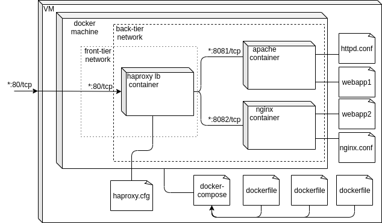
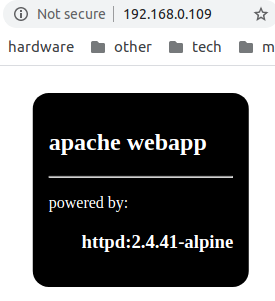

## <p style="text-align: center;">Docker</p>

### <p style="text-align: center;">Docker-compose</p>


#### run project

To start the project, replace the data in the `app1` and` app2` folders with your own and from the folder containing `docker-compose.yaml` run the command: 
```bash
docker-compose up --build
```

#### project structure
For right work the main files of project must be located as on pattern below:  
<pre>
.
├── app1
│   └── index.html
├── app2
│   └── index.html
├── diagram.drawio
├── docker-compose.yaml
├── haproxy
│   ├── dockerfile
│   └── haproxy.cfg
├── httpd
│   ├── dockerfile
│   └── my-httpd.conf
├── img
│   ├── 1.png
│   ├── 2.png
│   └── diagram.png
├── logs
│   ├── build.log
│   └── work.log
├── nginx
│   ├── dockerfile
│   └── nginx.conf
└── README.md
</pre>  

***
#### other
##### file references
[./app1/index.html](./app1/index.html) and [./app2/index.html](./app2/index.html) - web application files;  
[diagram.drawio](./diagram.drawio) and [./img/diagram.png](./img/diagram.png) - files of UML Diagram;  
[./haproxy/haproxy.cfg](./haproxy/haproxy.cfg) - haproxy config;  
[./httpd/my-httpd.conf](./httpd/my-httpd.conf) - apache config;  
[./nginx/nginx.conf](./nginx/nginx.conf) - nginx config;  
[docker-compose.yaml](docker-compose.yaml) - main file of project;  
[apache](./httpd/dockerfile), [nginx](./nginx/dockerfile), [haproxy](./haproxy/dockerfile) - dockerfile for each container of project;  
[build.log](./logs/build.log) - logging of the latest build process;  
[work.log](./logs/work.log) - logging of the latest working process;  
[img](./img) - image folder.


##### working images
The page after click on reload button:  
 