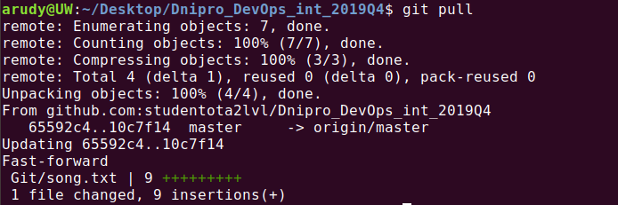

## 
Module 1: Git

Homework - [https://docs.google.com/](https://docs.google.com/document/d/1QPB3P0LcLBUwTS9LckgrUpHzLj4f-UsaUKDZPewWvtA/edit)  

full text of song "nothing else matters" [here](./song.txt)  

### task 1.1
key has been created before_^)  
  

### task 1.2
  

### task 1.3
Repository was cloned  
 

### task 1.4 - 1.7
we have second part of song and the second commit  
  

### task 1.8
`git clone` and ...  
 

We have all text of song  
  