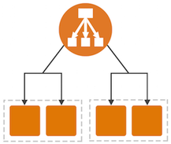
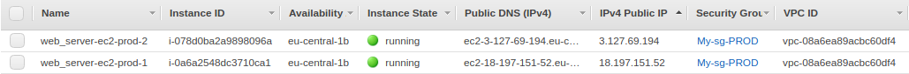
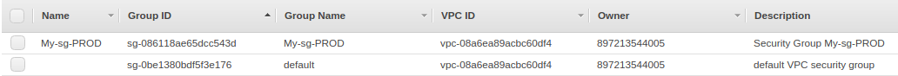
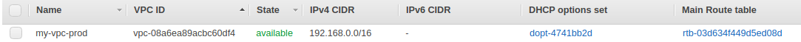
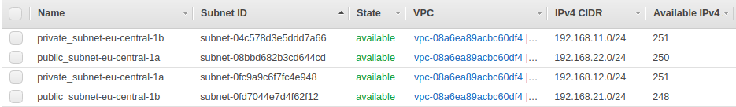
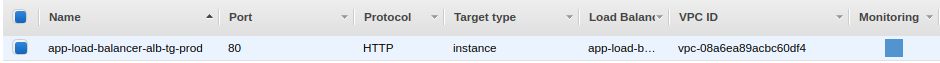
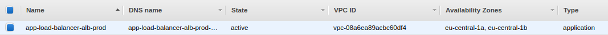
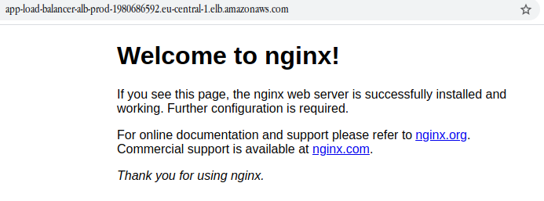

## <p style="text-align: center;">AWS</p>

### <p style="text-align: center;">AWS ALB through Terraform</p>
<div style="text-align:center">
    
    
</div>

***
tasks:  
1. Start an EC2 instance;  
2. Add an EBS volume to the instance;  
3. Set up a web server behind an application load balancer.  

***

#### Brief manual
To deploy solution please install terraform via install script from root folder:
```bash
sudo chmod +x ./installTerraform.sh && sudo ./installTerraform.sh;
```
Pay notice!  
You have to change aws keypair name on module file `./modules/vpc/vpc.tf`, string 437 and 470 `key_name = "name_of_your_keypair"`. Need to create variables;  
You have to import AWS_ACCESS_KEY and AWS_SECRET_KEY as environment variable. Use this command for it:  
```bash
export AWS_ACCESS_KEY=YOUR_AWS_ACCESS_KEY
export AWS_SECRET_KEY=YOUR_AWS_SECRET_KEY
```
And you have to set path to your ssh keys in ec2 module variables file on 74 and 79 strings:
```
variable "key_path" {
    description = "Key path to your RSA|DSA key"
    default     = "/path/to/your/public/key/id_rsa.pub"
}

variable "private_key" {
    description = "Private key"
    default     = "/path/to/your/private/key/id_rsa"
}
```
or it is better way, reassign that variables in `main.tf`

Than terraform will be installed go to `all`-folder and put command below to the terminal:  
```bash
terraform init;
terraform apply; # to run deploy without approve use `terraform apply -auto-approve`
```
For remove all item of the solution please run command below from `vpc`-folder.  
```bash 
terraform destroy; 
# or
# terraform destroy -auto-approve
```

***

#### img
Created resources:  
ec2  
  

security groups  
  

vpc     
 

subnets   
 

target group  
  

elastic load balancer
  

nginx web server, which are working on both server  
<div style="text-align:center"></div>

***

#### file references
[installTerraform.sh](./installTerraform.sh) - bash script for install terraform;  
[terraform_init.log](./terraform_init.log) - terraform init log file;  
[terraform_plan.log](./terraform_plan.log) - terraform plan log file;  
[terraform_apply.log](./terraform_apply.log) - logging deploy process;  
[terraform_destroy.log](./terraform_destroy.log) - logging destroy process;  
[main.tf](./all/main.tf) - main file of solution;  
[img](./img) - image folder.  

***

#### folder structure
<pre>
.
├── all
│   └── main.tf
├── img
│   ├── 101.png
│   ├── 102.jpg
│   ├── 1.png
│   ├── 2.png
│   ├── 3.png
│   ├── 4.png
│   ├── 5.png
│   ├── 6.png
│   └── 7.png
├── installTerraform.sh
├── logs
│   ├── terraform_apply.log
│   ├── terraform_destroy.log
│   ├── terraform_init.log
│   └── terraform_plan.log
├── modules
│   ├── alb
│   │   ├── alb.tf
│   │   ├── outputs.tf
│   │   └── variables.tf
│   ├── ec2
│   │   ├── ec2.tf
│   │   ├── init.tpl
│   │   ├── outputs.tf
│   │   └── variables.tf
│   ├── iam
│   │   ├── iam.tf
│   │   ├── outputs.tf
│   │   └── variables.tf
│   └── vpc
│       ├── init.tpl
│       ├── outputs.tf
│       ├── variables.tf
│       └── vpc.tf
└── README.md
</pre>