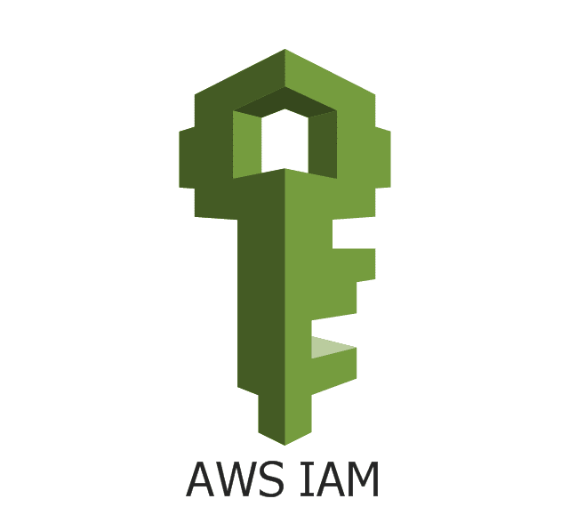
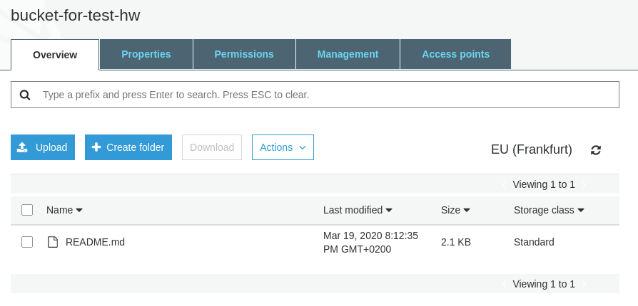
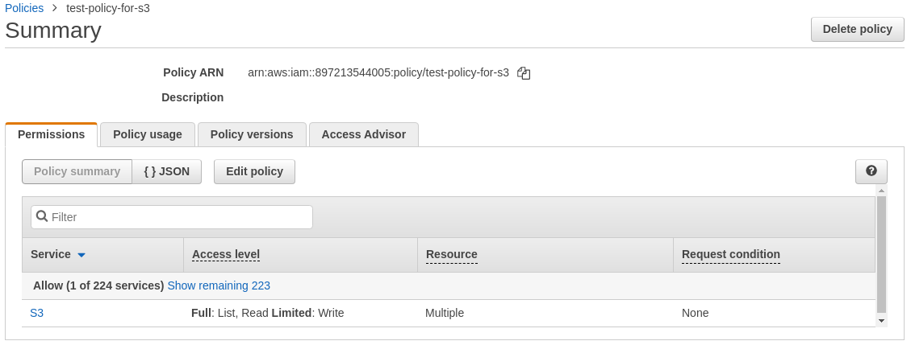
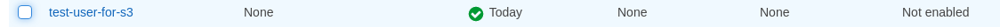
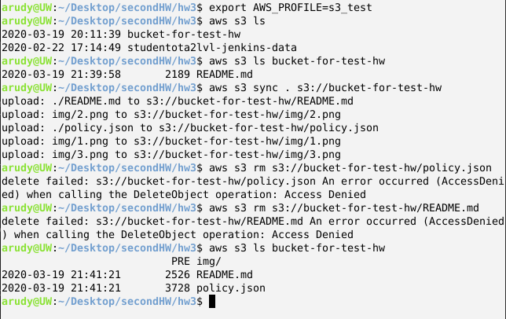
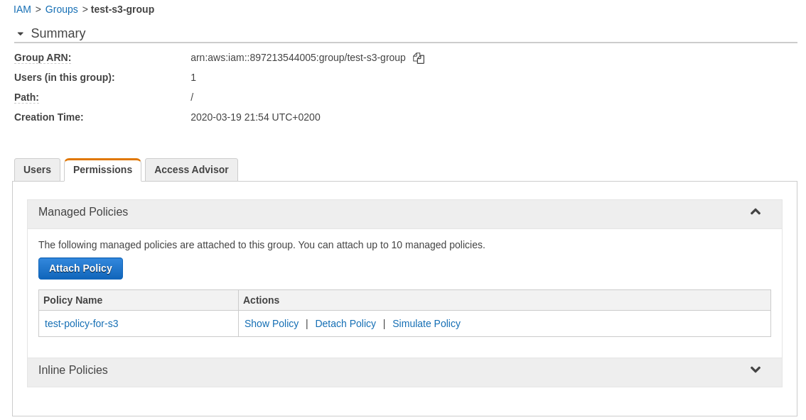
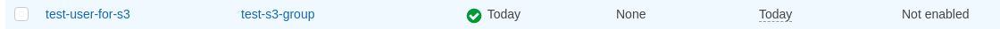
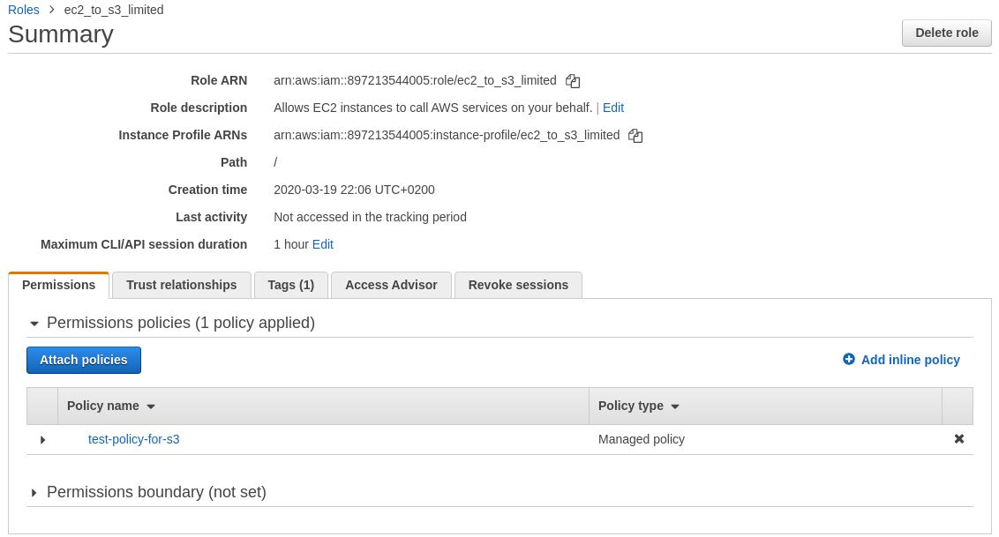
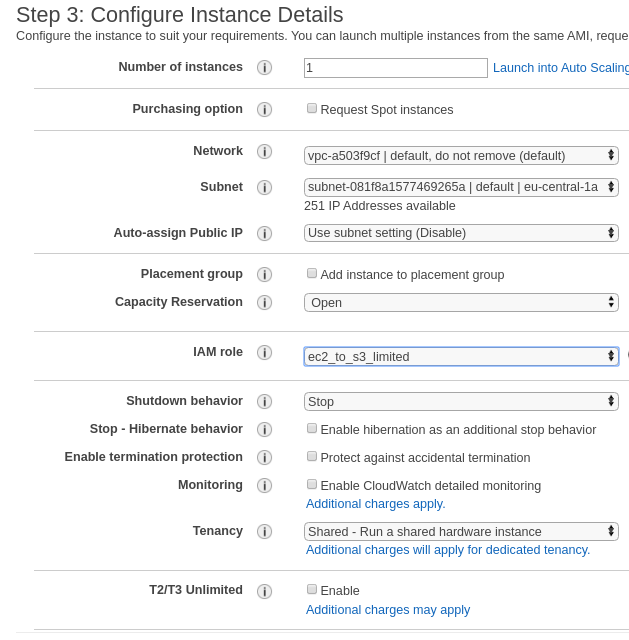

<p align="center">
  
</p>

***
tasks:  
1. Create a bucket and add a file to the bucket;  
2. Create an IAM user;  
3. Allow the IAM user read/write access to the file in the bucket;  
4. Create an IAM group;  
5. Add the user to the group;  
6. Add a policy to the group;  
7. Create and use a role.  


***
#### Created bucket with file inside  
<p align="center">
  
</p>

#### Created policy for IAM user  
<p align="center">
  
</p>

#### IAM user was created  
<p align="center">
  
</p>

#### Check IAM user credentials and his permissions  
<p align="center">
  
</p>

#### Created group and attached policy to it
<p align="center">
  
</p>

#### Adding IAM user to the group
<p align="center">
  
</p>

#### Created role and attached policy to it
<p align="center">
  
</p>

#### Creating ec2 with created IAM role
<p align="center">
  
</p>

#### Check role
<p align="center">
  
</p>

command list:  
```bash 
curl "https://awscli.amazonaws.com/awscli-exe-linux-x86_64.zip" -o "awscliv2.zip"
unzip awscliv2.zip
sudo ./aws/install
aws --version
aws s3 ls
aws s3 ls bucket-for-test-hw # command with needed access
aws s3 ls studentota2lvl-jenkins-data # command without needed permissions
```

***

#### file references

[policy.json](./policy.json) - file with need policy for get s3 buckets list, get files list from created bucket, and put object to him;  
[img](./img) - image folder.  
