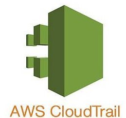
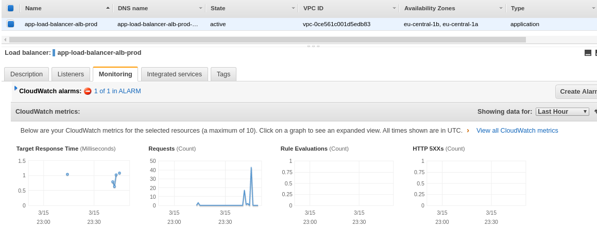
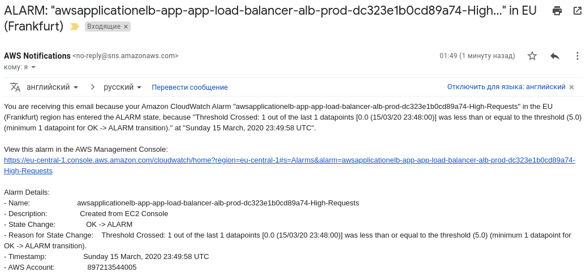
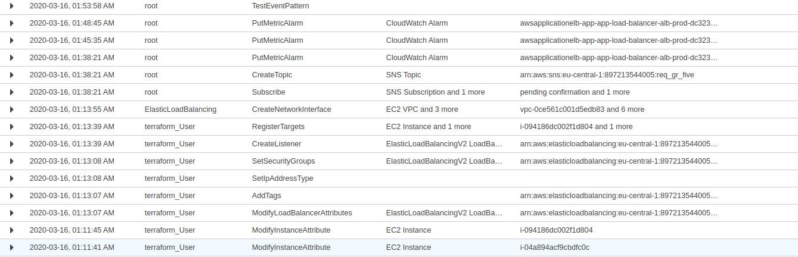
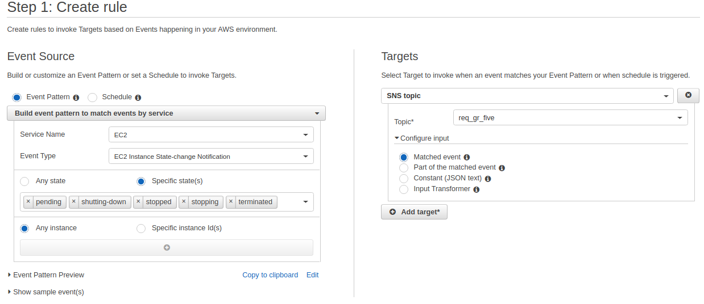
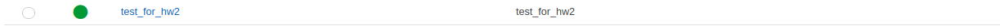
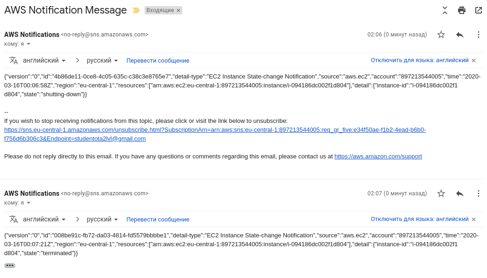

## 
AWS

### 
Monitoring/Alerts/Events

 

***
tasks:  
1. Check monitoring metrics of the instance created during the previous homework. Set up alerts;  
2. Check CloudTrail logs and see who did what in your account;  
3. Set up CloudWatch events.  

***
#### Checking elb metrics, and creating alert  
  
  

  
***
#### CloudTrail logs  

***
#### Сreating cloudWatch event which check ec2 state change  
  
  
  
  
