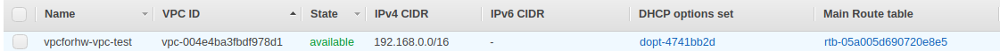
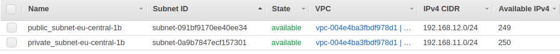
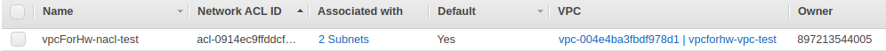
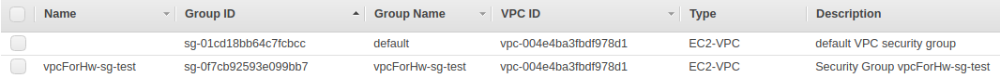
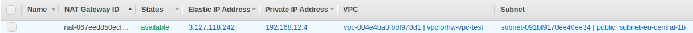
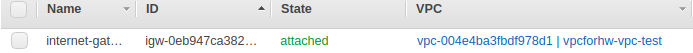
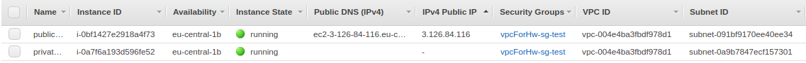
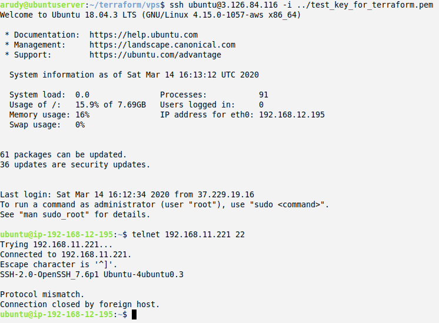
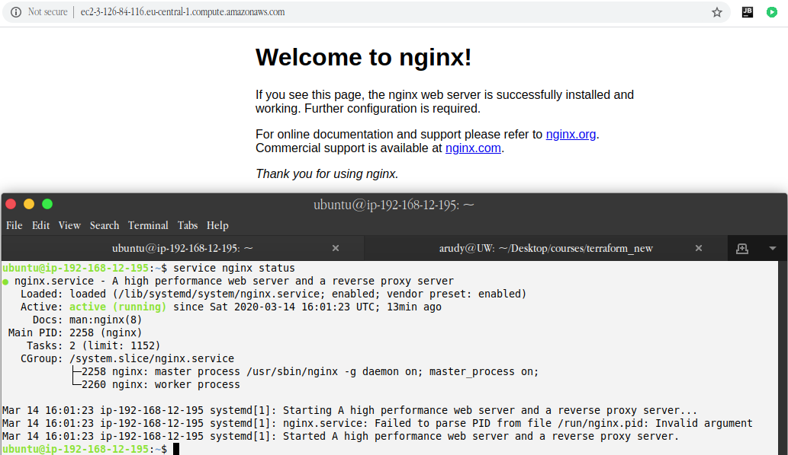

## <p style="text-align: center;">AWS</p>

### <p style="text-align: center;">AWS VPC through Terraform</p>
 

***

#### Brief manual
To deploy solution please install terraform via install script from root folder:
```bash
sudo chmod +x ./installTerraform.sh && sudo ./installTerraform.sh;
```
Pay notice!  
You have to change aws keypair name on module file `./modules/vpc/vpc.tf`, string 437 and 470 `key_name = "name_of_your_keypair"`. Need to create variables;  
You have to import AWS_ACCESS_KEY and AWS_SECRET_KEY as environment variable. Use this command for it:  
```bash
export AWS_ACCESS_KEY=YOUR_AWS_ACCESS_KEY
export AWS_SECRET_KEY=YOUR_AWS_SECRET_KEY
```
Than terraform will be installed go to `vpc`-folder and put command below to the terminal:  
```bash
terraform init;
terraform apply; # to run deploy without approve use `terraform apply -auto-approve`
```
For remove all item of the solution please run command below from `vpc`-folder.  
```bash 
terraform destroy; 
# or
# terraform destroy -auto-approve
```

***

#### img
Created resources:  
vpc  
  
subnets  
  
network acl  
  
security groups  
  
nat gateway  
  
internet gateway  
  
ec2 dashboard  
  
connect to both ec2 in vpc  
  
check executing user data  
  

***

#### file references
[installTerraform.sh](./installTerraform.sh) - bash script for install terraform;  
[terraform_init.log](./terraform_init.log) - terraform init log file;  
[terraform_plan.log](./terraform_plan.log) - terraform plan log file;  
[terraform_apply.log](./terraform_apply.log) - logging deploy process;  
[terraform_destroy.log](./terraform_destroy.log) - logging destroy process;  
[init.tpl](./modules/vpc/init.tpl) - ec2 initial script template;  
[outputs.tf](./modules/vpc/outputs.tf) - list of output variables;  
[variables.tf](./modules/vpc/variables.tf) - list of default input variables;  
[vpc.tf](./modules/vpc/vpc.tf) - module file;  
[main.tf](./vps/main.tf) - main file of solution;  
[img](./img) - image folder.  
