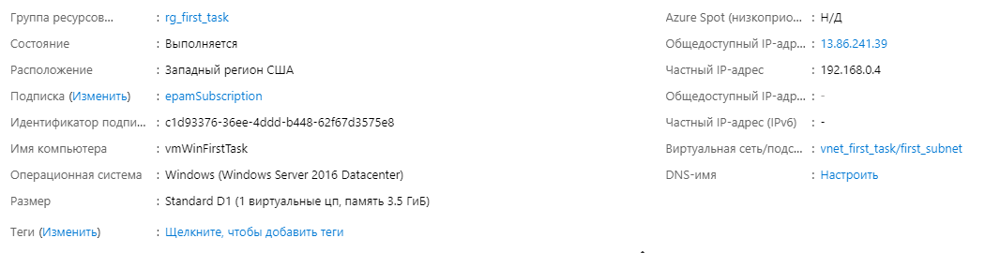
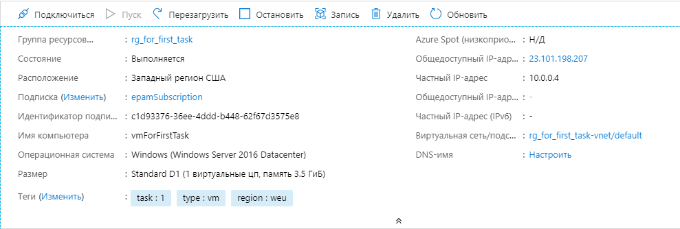

## 
AZURE

### 
Azure/Win2016/IIS

    

***
tasks:  
1. Create VNet, VM, Loadbalancer, IIS server via Azure Portal.  
2. Create IIS server via ARM template.  
3. Change IIS default start page (ARM template or custom script).  

***
#### img
Created resources:  
network params  
  
  
  
vm params  
   
  
  
lb params   
  
  

created lb and vm with iis   
  
  
  
IIS via ARM  
configs in files [setup.ps1](./setup.ps1), without change `.htm` content, [azure.deploy.json](./azure.deploy.json) and [azure.parameters.json](./azure.parameters.json)  
  

  
Changed IIS gefault web page (easy way, through edit file of default page, harder one in the same file, [here(full/uncommented)](./setup.ps1))  
  

***

#### file references
[azure.deploy.json](./azure.deploy.json) - azure resource manager template.  
[setup.ps1](./setup.ps1) - windows initial script.  
[azure.parameters.json](./azure.parameters.json) - arm params file.  
[img](./img) - image folder.  
[WebApp](./WebApp) - folder for my tests.  

***

#### folder structure
<pre>
will be update...
</pre>