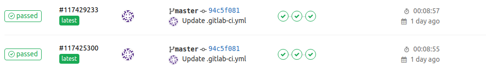

### 
Pipeline for build Jenkins image

For run it you have to put .gitlab-ci.yml to root folder of you repo. So, it is all_^)
Every time when you, or your team, make commit, gitlab by someselves generate start your build process)
Jenkins image have some settings, like as installed plugins and added new admin account. When you attach volume to `/ver/lib/jenkins` this settings will  lost.

#### other
photo of the build process
  

***
#### file references
[img](./img) - image folder;  
[dockerfile](./dockerfile) - dockerfile for jenkins master;  
[plugins.txt](./plugins.txt) - list of the plugins;  
[.gitlab-ci.yml](./.gitlab-ci.yml) - gitlab CI pipeline file;  
  
#### links
[docker registry](https://registry.hub.docker.com/r/studentota2lvl/jenkins) -link to docker registry. 