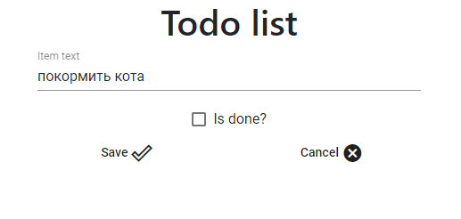
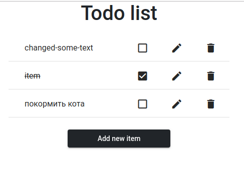

### 
Pipeline for todo web-application

This solution powered by docker. All services deploy into docker containers.  
For run it, just pyt one of pipeline to root dir of the your repo, change credentials and ditlab himself rut this pipeline. Also you have to change `web_server` url in the both pipelines.

#### other
photo of the app  
  

***
#### file references
[backend.gitlab-ci.yml](./backend.gitlab-ci.yml) - pipeline for backend part application;  
[frontend.gitlab-ci.yml](./frontend.gitlab-ci.yml) - pipeline for frontend part application;   
[img](./img) - image folder;  

#### links
[front-TODO](https://github.com/studentota2lvl/front-TODO) - repo with angular frontend application;  
[back-TODO](https://github.com/studentota2lvl/back-TODO) - repo with node.js backend application;  

