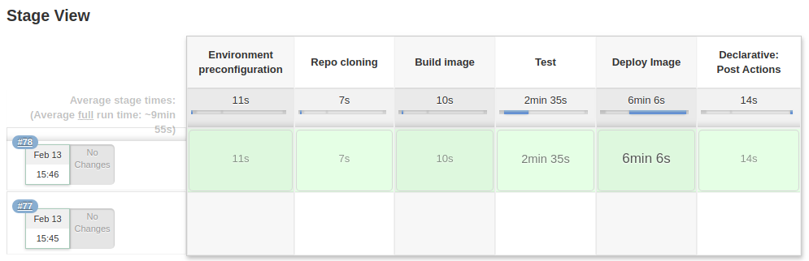

## 
Jenkins

### 
Pipeline for build Jenkins image

This solution is working on docker.  
For run it you have to change volume folder in docker-compose file and enter to command line `docker-compose up` from repo root dir, and go to `localhost:80`. Initial credential must be the same as in your own jenkins server. Please paste pipeline script to pipeline block in your job and ckick "save" button. Also you must manualy add slave node to known host by click `Manage Jenkins -> Manage Nodes and Clouds -> docker agent -> trust ssh host key`. And after that you may ckick "Build now" button_^)

#### other
photo of the build process
    

***
#### file references
[build.log](./log/build.log) - docker-compose build log;  
[run.log](./log/run.log) - docker-compose up log;  
[img](./img) - image folder;  
[master.Dockerfile](./master/master.Dockerfile) - dockerfile for jenkins master;  
[nginx.conf](./master/nginx.conf) - configuration file for nginx reverse proxy;  
[slave.Dockerfile](./slave/slave.Dockerfile) - dockerfile for jenkins slave;  
[supervisord.conf](./slave/supervisord.conf) - configuration file for supervisor daemon;  
[key.pub](./slave/key.pub) - public SSH key for connection from master to slave, private key located in master dir;
[docker-compose.yml](./docker-compose.yml) - main file of project;  
[master](./master) - jenkins master's folder;  
[slave](./slave) - jenkins slave's folder;  
[pipeline.log](./log/pipeline.log) - jenkins pipeline build log.  
#### links
[docker registry](https://registry.hub.docker.com/r/studentota2lvl/jenkins) -link to docker registry. 