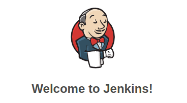

## 
Jenkins

### 
Pipeline for todo web-application

This solution powered by docker. All services build and deploy into docker containers.  
For run it, just paste one of pipeline to your job, and i guess, you have to add few credentials_^) 

#### frontend pipeline
That script take files from remote repo, carry on to node.js docker container that will make build. After that he send artifact to web-server, on which installed an are working nginx reverse proxy.  

#### backend.groovy
As is for backend application, which writed on node.js, we don't should to build, we just make git clone step and send to remote web-server. Web-server consist of node.js docker container. In the next step we sen comand by ssh that reboot node.js container.

#### other
photo of the app  

***
#### file references
[frontend.groovy](./frontend.groovy) - pipeline for angular frontend aplication;  
[backend.groovy](./backend.groovy) - pipeline for node.js backend aplication;  
[img](./img) - image folder;  
[docker-compose.yml](./docker-compose.yml) - main file of web-server;  
[nginx](./nginx) - folder for nginx container files;  
[node](./node) - folder for node.js container files.  

#### links
[front-TODO](https://github.com/studentota2lvl/front-TODO) - repo with angular frontend application;  
[back-TODO](https://github.com/studentota2lvl/back-TODO) - repo with node.js backend application;  

